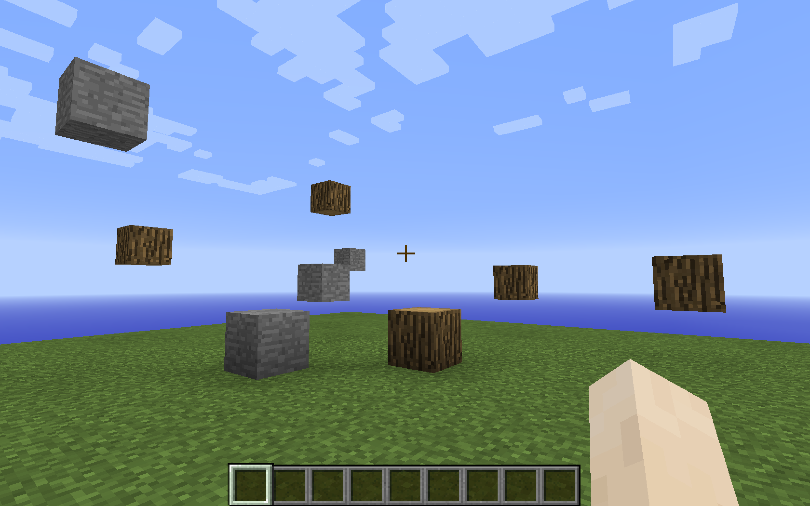

# Minecraft Machine Learning Dataset: Generation Instructions

## Overview
The files needed to generate the Minecraft dataset are provided here.

The world has one chunk defined, which is 16x16 blocks wide by 256 blocks high.

## Contents
* **world** - The ```world``` folder in the Minecraft server folder should be replaced with this folder.
* **server.properties** - The ```server.properties``` file in the Minecraft server folder should be replaced with this file.
* **world-processed** - This is what the ```world``` folder is transformed into after it is loaded the first time by the Minecraft server.

## Screenshot


## Instructions
* Use [MCEdit Unified](https://khroki.github.io/MCEdit-Unified/) as a GUI world editor and a Python programmatic world editor.

