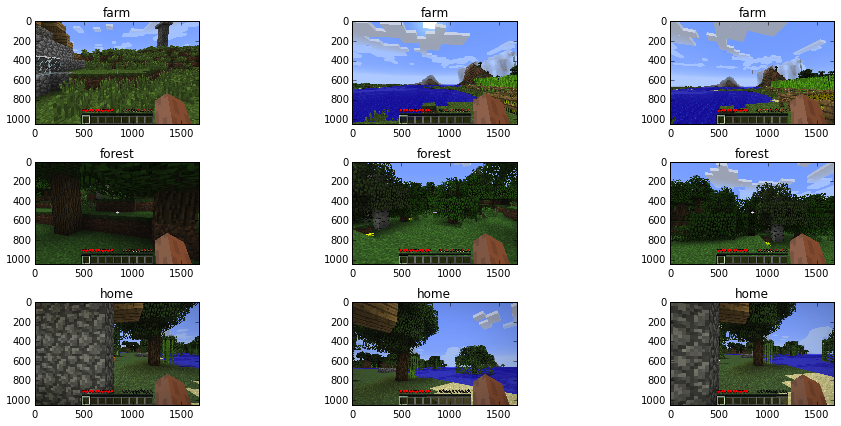
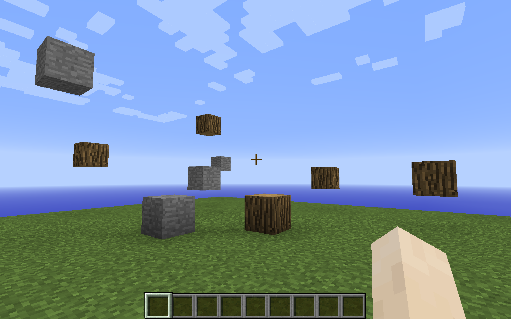
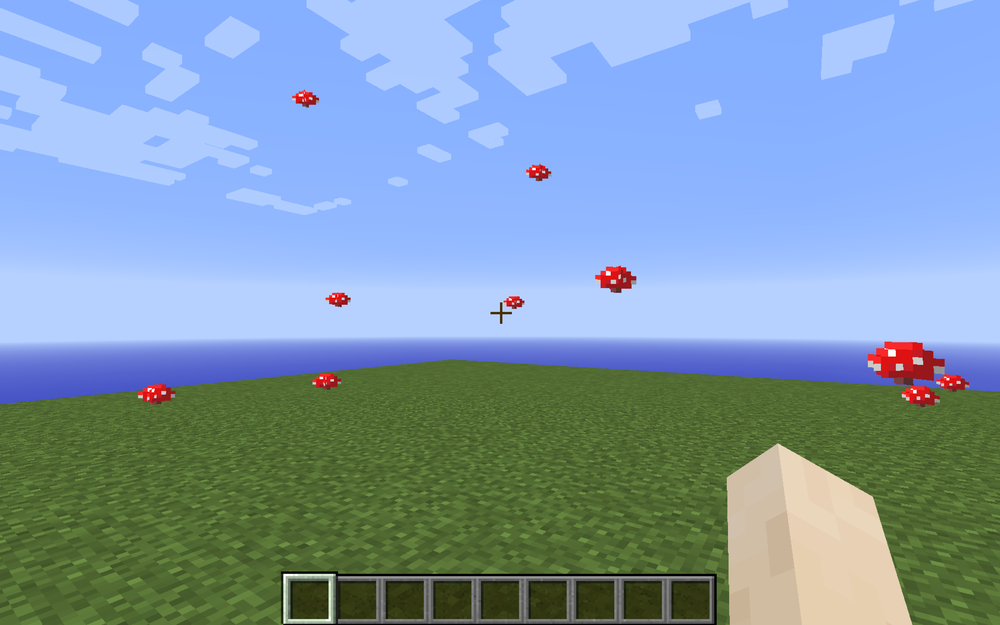
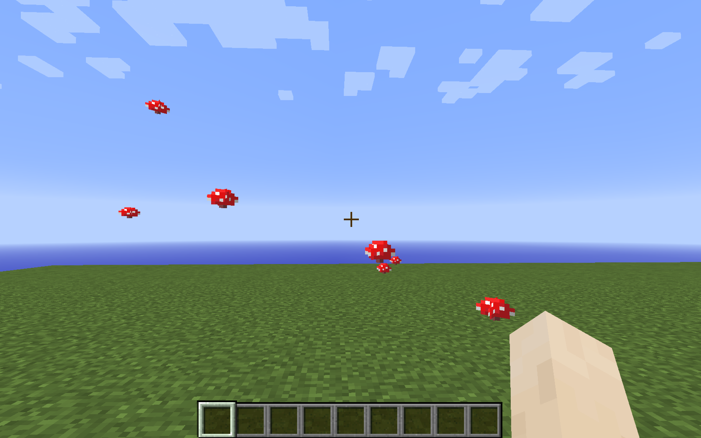
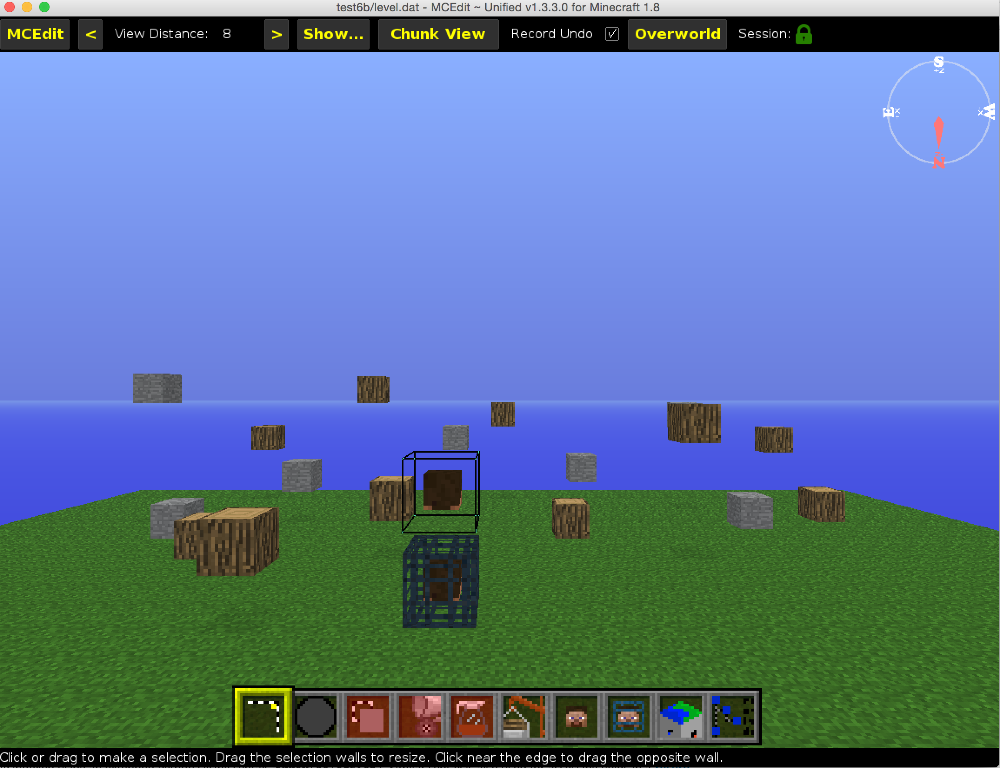

# Minecraft Machine Learning Dataset: Generation Instructions

## Note: This is in-progress and incomplete. The initial release has not yet occurred.

## Overview
The files needed to generate the Minecraft dataset are provided here.

## Contents
* **make-hdf5** - Jupyter notebook. After capturing Minecraft screenshots into **png** files, this utility produces an HDF5 datafile from them. Includes examples of how to create and how to read the HDF5 datafile.

* **world** - The ```world``` folder in the Minecraft server folder should be replaced with this folder. For example:
```
$ rm -r /Users/cosmo/minecraft-server/world
$ cp -R ~/minecraft-dataset-generation/world /Users/cosmo/minecraft-server/
```
* **server.properties** - The ```server.properties``` file in the Minecraft server folder should be replaced with this file.
* **world-processed** - This is what the ```world``` folder is transformed into after it is loaded the first time by the Minecraft server.

## Additional contents (optional)
* **access-world.py** - Illustrates how to use the ```pymclevel``` Python interface to interact with world data by printing the 2D NumPy array for each slice of the world that contains blocks.

## Screenshot

### Minecraft world regions


### Inside the Minecraft client




### Using the MCEdit level editor


## Instructions
* Download [MCEdit Unified](https://khroki.github.io/MCEdit-Unified/) as a GUI world editor
* Clone the [MCEdit Unified repository](https://github.com/Khroki/MCEdit-Unified) to obtain the Python programmatic world editor.
* To run ```access-world.py```, **cd** to the ```MCEdit-Unified``` folder that you cloned from the repository, and run ```python2 ~/minecraft-dataset-generation/access-world.py``` (replace with the correct path on your system as needed.)
* If you want to add additional functionality beyond that contained in ```access-world.py```, the file ```pymclevel/mclevel.py``` in the ```MCEdit-Unified``` repository provides a useful explanation of how to interact with the ```pymclevel``` API.
