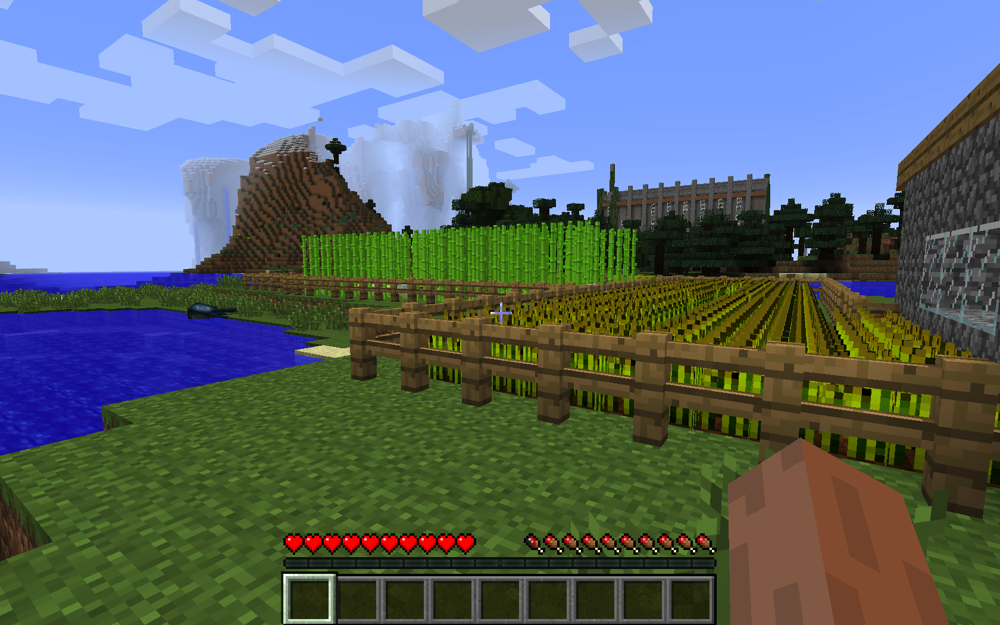

# Minecraft region dataset #1

## Description
The dataset consists of 3600 examples. Each example consists of a screenshot sampled from three fixed positions, ```farm```, ```forest``` and ```home```. There are 1200 images from each region. The ```pitch``` and ```yaw``` of the agent was varied randomly in each location before each image was captured.

## Dataset file
The dataset is in a file named ```region-dataset-1.tar.gz```.

## Images
The images are organized in three folders according to region. Additionally, there is a test folder that contains 3 images from each region.

### Example image
<center></center>
