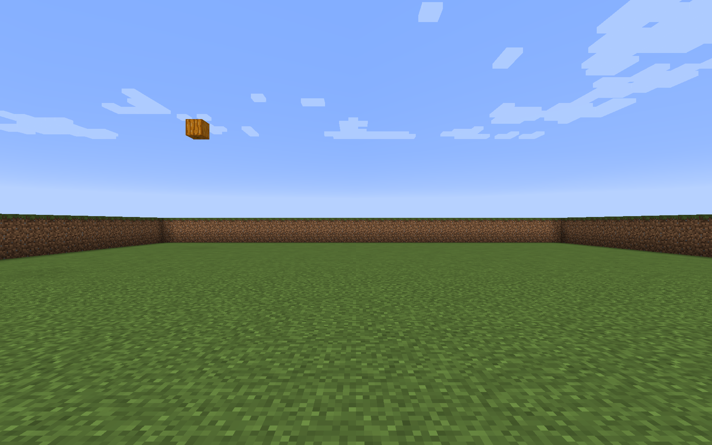

# Minecraft single block dataset #1

## Description
The dataset consists of 8080 examples. Each example consists of a screenshot from the perspective of an agent located at a fixed position and fixed pose in the world. At all times, one block is placed in the world. The factors of variation are the x, y, z coordinates of the block and the type of the block. The x, y, z coordinates are varied between all integers between the following minimum and maximum values:
- **x** -9 to 10
- **y** 3 to 9
- **z** 0 to 10

The block types are varied between: **stone**, **log**, **bedrock**, **diamond_ore**, **pumpkin**.

## Images
The images have filenames that consist of ```[counter].png```, where counter is a unique identifier, consisting of an integer ranging between 1 to 8080. These unique identifiers join the image to the ```counter``` value found in each row in the CSV file.

### Example image
<center></center>

## CSV data definition
The data is stored in a CSV file named ```single-block-dataset-1.csv```.

### Header
The CSV file contains the following header:
```
counter,block_x,block_y,block_z,block_type,bot_x,bot_y,bot_z,bot_pitch,bot_yaw
```

### Example row
```
8080,10,9,10,5,0.5,2.001,-9.5,0,180
```

### Column definitions
Each column is defined as follows.
* **counter**
int (unique identifier, joins the row to the associated image file)
* **block_x** int
* **block_y** int
* **block_z** int
* **block_type** int (categorical: values map to the following Minecraft block types)
  - **1** stone
  - **2** log
  - **3** bedrock
  - **4** diamond_ore
  - **5** pumpkin
* **bot_x** float
* **bot_y** float
* **bot_z** float
* **bot_pitch** float
* **bot_yaw** float
